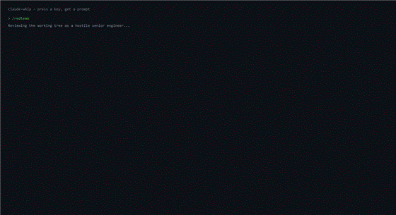

# claude-whip

Sixteen hotkeys that fire pre-written, high-leverage prompts into Claude Code. Each press plays a synthesized whip crack and lashes a leather bullwhip across your terminal.



**It does not make the model think faster. Nothing can.** There is no prompt, no hotkey and no tool that changes how quickly Claude reasons. What this does is make the prompts you never bother typing cost one keystroke.

That is the whole pitch. The prompts in this repo are ones most people know they *should* send — a hostile pre-merge review, a scaling and cost check, a decision record, a handoff note — and don't, because typing three hundred words of careful instruction at the moment you are tired and almost done is a tax nobody pays. Binding them to a function key removes the tax. The whip is there so it feels like something happened.

```powershell
git clone https://github.com/rrkher059/claude-whip
cd claude-whip
.\install.ps1
```

That installs dependencies, copies the skills, generates the sound, adds a Startup shortcut, starts the tool and runs a health check. It is safe to run again.

---

## The sixteen bindings

| Key | Command | What it actually buys you |
|---|---|---|
| `F1` | `/whip` | Hard stop on overbuilding. Sets standing rules — smallest change, no new files, no one-caller helpers, no speculative error handling — and deletes any excess already written. The most useful key here. |
| `F2` | `/redteam` | Hostile senior-engineer review of the **live working tree**, grounded in a real `git diff`. Three sections: what breaks in production, security, the one thing to fix first. No praise. |
| `F3` | `/ship` | Detects your test and lint commands, runs them, and commits + pushes **only if they pass**. On failure it stops and shows the output without "helpfully" fixing anything. Double-tap to confirm. |
| `F4` | `/decide` | Appends a dated entry to `DECISIONS.md` — decision, why, what you rejected, and the signal that should reopen it. Six months from now this is the only record of why. |
| `F5` | `/scale` | This code at 100x traffic: what breaks first and at what load, cost per 1,000 users with assumptions stated, and the cheapest fix that buys the most headroom. |
| `F6` | `/unstuck` | Circuit breaker for debugging loops. Writes no code. Forces out the assumption you have both been treating as true without checking — usually the bug — then picks a five-minute experiment. |
| `Shift+F1` | `/orient` | Unfamiliar or forgotten repo. What it does, the five files that matter, how data flows end to end, the one piece of architecture you will otherwise trip over. |
| `Shift+F2` | `/secure` | Full-repo security sweep. Secrets, missing authorization, injection, CORS wildcards, missing rate limiting, PII in logs — ordered by what gets exploited first. |
| `Shift+F3` | `/test` | Writes the one regression test that would have caught the bug you just fixed, matching your conventions. Must fail against the old behaviour or it isn't a regression test. |
| `Shift+F4` | `/debt` | The three worst things ranked by **six-month cost, not ugliness**. "Leave it" is an allowed and frequently correct verdict. |
| `Shift+F5` | `/user` | Walks your real entry path as a first-time user. Where confusion starts, which steps could be deleted, what breaks with no data or a typo. |
| `Shift+F6` | `/handoff` | Overwrites `HANDOFF.md` so a zero-context session resumes exactly where you stopped. |
| `Ctrl+F1` | `/cost` | Every paid model call in the repo, the monthly bill at stated usage, and the one call path responsible for most of it. |
| `Ctrl+F2` | `/why` | Runs `git log -p --follow` on a file and explains why the code is that way from its real history — the scar tissue, and what was already tried and reverted. |
| `Ctrl+F3` | `/simplify` | Three functions with the worst complexity-to-value ratio, each with a real diff and proof the complexity isn't earning its keep. |
| `Ctrl+F4` | `/onboard` | Generates `CONTRIBUTING.md` from lockfiles, scripts and CI rather than boilerplate. |

`Ctrl+Alt+P` opens a searchable palette of all sixteen. `Ctrl+Z` within two seconds of a fire interrupts Claude and toasts `cancelled`.

Every skill is marked `disable-model-invocation: true`. These are deliberate manual triggers — Claude will never decide on its own that now is a good time to run `/ship`.

**The skills work without any of this.** They are ordinary Claude Code slash commands; copy `skills/` into `~/.claude/skills/` and type `/redteam` by hand. See [skills/README.md](skills/README.md) — that directory is the most forkable part of this repo.

## Why F2 has teeth

Most "review my code" prompts get answered from whatever the model remembers, which drifts from what is on disk.

`/redteam` opens with a dynamic-context line:

```markdown
!`git diff HEAD`
```

Claude Code executes that **before** the model reads the rest of the prompt, so your real working tree is already in context when the instructions arrive. The review is grounded in the code you are about to commit, not a recollection of it. `/orient` and `/why` use the same mechanism for `git log`.

If the diff is empty, the skill is told to say so and stop rather than inventing a review.

## Config

`config.ini` is written with defaults on first run and is gitignored, so your settings are yours.

```ini
[whip]
sound=              ; custom wav; blank uses whip.wav next to the script
titles=claude       ; comma-separated fragments matched against the window title
debug=0             ; 1 logs every non-matching window title to whip.log
hud=1               ; the corner tab and its expanding binding list
volume=1            ; 0 mutes
animate=1           ; 0 skips the visuals and just sends the command
theme=leather       ; leather | midnight | ember | bone
shake=1             ; one-frame screen shake on the snap
hudcorner=br        ; tl | tr | bl | br - set by dragging the tab
palette=^!p         ; palette chord: ^ Ctrl, + Shift, ! Alt, # Win
confirm=ship        ; commands that need a double-tap first

[keys]
F1=whip
...                 ; all sixteen are freely remappable
```

Behaviour follows the **command**, not the key: `ship` always double-taps and `decide` / `debt` / `why` always prompt for arguments, wherever you bind them. Remapping keeps safety.

Tray menu: reload config, open config, open log, show stats, pick Claude window, show welcome, toggle HUD, pause hotkeys, exit.

### Themes

Four ship in one table at the top of `whip.ahk`. Adding one is ten colours and a name:

```ahk
"midnight", Map("g1","070910", "g2","0E131F", "under","04060A", "body","161C2B", "band","0F1420"
             , "crk","1E2639", "hi","5B87C7", "core","E8F2FF", "ring","A8C8F0", "spark","D6E8FF"),
```

`g1`/`g2` are the motion-blur ghosts, `under` the shadowed underside, `body` the leather, `band` the grip wraps, `crk` the cracker, `hi` the highlight, and `core`/`ring`/`spark` the snap. `bone` is deliberately the darkest body of the four — a pale whip is invisible on a light terminal, so the bone colour is the highlight, not the leather.

### Chains

A binding whose value contains `|` runs its steps in order, with `wait <seconds>` available between them:

```ini
[keys]
F7=redteam | wait 45 | test
F8=secure | wait 60 | handoff
```

Both ship commented out. The whole `[keys]` section is read, so `F7`, `F8` and anything else you add work. While a chain waits it toasts a countdown and **Escape cancels**.

**`wait-idle` is deliberately not implemented.** There is no reliable way to tell from outside the terminal that Claude has stopped producing output: the window title does not change, there is no exit code to wait on, and pixel-diffing the terminal is defeated by both a blinking cursor and a ticking token counter. A step that guessed wrong would fire the next command into a half-finished answer. If you put `wait-idle` in a chain it stops with an explicit message instead. Use a generous `wait`.

### Which commands write something

| command | what it writes |
|---|---|
| `/ship` | commits **and pushes** |
| `/decide` | appends to `DECISIONS.md` |
| `/test` | adds a test file, then runs it |
| `/handoff` | overwrites `HANDOFF.md` |
| `/onboard` | overwrites `CONTRIBUTING.md` |

Only `/ship` double-taps by default, because it is the only one that leaves your machine. Add others with `confirm=ship,handoff,onboard`.

### Picking a hotkey

**Check any chord against Windows Terminal's package `defaults.json` before binding it**, not just your own `settings.json` — the defaults apply even when your `keybindings` array is empty. Two that look free and are not:

| chord | what it really does |
|---|---|
| `Ctrl+Shift+Space` | `Terminal.OpenNewTabDropdown` |
| `Ctrl+Shift+W` | `Terminal.ClosePane` — **closes your tab** |

These ctrl+shift letters are unclaimed in Windows Terminal: **b e g h i j l o q r s u x y z**.

The palette defaults to `Ctrl+Alt+P`. On international layouts AltGr sends Ctrl+Alt, so if you use one, rebind `palette=` to a ctrl+shift letter above.

## Troubleshooting

**Start here:**

```powershell
.\whip.ahk --doctor
```

It prints your AutoHotkey version and path, display scaling, the wav's parsed header and measured peak amplitude, which of the sixteen skills are on disk, your current `titles=` and whether the focused window actually matches it, whether `config.ini` carries a UTF-8 BOM, and the last five errors — then a verdict. Paste that into an issue.

**The hotkeys do nothing.** Almost always title detection. Every hotkey is scoped so `F1` stays `F1` everywhere else; if your terminal doesn't put "claude" in its title, nothing fires. Fix it without touching a config file:

```powershell
.\whip.ahk --pick
```

Pick your window from the list, trim the text to the part that never changes, save. It writes `titles=` for you. The tool also offers this by itself if a terminal stays focused for a minute without ever matching.

**Nothing takes effect when I edit config.ini.** Check `--doctor` for `utf-8 bom`. Windows' INI functions do not skip a BOM, so an editor that adds one makes *every* setting silently fall back to its default. The tool strips it at startup, but that is the classic cause.

**The whip blocks my terminal.** It cannot — the overlays are `WS_EX_TRANSPARENT | WS_EX_NOACTIVATE`, so they are click-through and can never take focus. Click straight through. If you want it gone anyway, `animate=0`.

**Other flags:** `--test [speed]` plays one crack (`--test 1` for real time), `--palette` and `--stats` open those windows directly, `--welcome` reopens the intro.

---

## How the rendering works

This is the part worth stealing.

AutoHotkey cannot draw an anti-aliased curve onto the desktop. What it *can* do is set an arbitrary polygonal **region** on a borderless window, clipping that window to any shape:

```ahk
WinSetRegion(points, "ahk_id " hwnd)
```

A shaped window is one flat colour, so one window gives you a silhouette, not leather. The trick is that you are not limited to one window. claude-whip stacks nine click-through shaped windows and recomputes every region each frame:

| Layer | Role |
|---|---|
| 2 ghosts | The shape at `t-0.10` and `t-0.05`, at 15% and 30% opacity. Motion blur. |
| Underside | The body offset down-and-right, darker. A shadowed edge. |
| Body | The leather. |
| Grip bands | Three short offset shapes, so the handle reads as bound leather rather than a stick. |
| Cracker | The last 7%, its own colour, trailing the body by a beat. |
| Highlight | Its own taper — widest mid-arc, gone before the tip. Not a scaled copy of the body. |
| Core + arc + 6 shards | The snap. |

Depth comes entirely from that layering. Collapse it to one window and it stops looking like leather.

### The traveling loop

The gross shape is a cubic bezier: handle anchored off the right edge, tip sweeping on a cubic ease-out, control points that **lag** the tip and then snap past it.

But a moving bezier reads as a swinging rope. What makes it a whip is the crack itself — a gaussian bump that *travels* from handle to tip. At each sample `s`, the point is offset perpendicular to its local tangent by:

```
offset = amp * exp(-((s - p) / 0.20)^2)
```

where `p = t*1.15 - 0.05` is the loop's position along the whip and `amp = 30*(1-t) + 7`, collapsing once `t > 0.94`. `p` walks from handle to tip as `t` advances, so the bump runs down the leather and the tip snaps past it exactly as the amplitude collapses. That is the entire illusion.

Timing carries the rest: 26 frames on a non-uniform budget — a slow wind-up where the whip pulls back with the tip lagging, fast frames through the loop travel, a held snap, then fade. A uniform frame time reads as a rope no matter how good the geometry is.

### Two bugs worth knowing about if you do AHK overlays

**`WinSetRegion` rejects the `Polygon` keyword.** Every v1 tutorial ends the point list with `" Polygon"`. AutoHotkey v2 throws `Parameter #1 is invalid` on it. Three or more bare points already form a polygon:

```ahk
WinSetRegion("256-432 2304-504 1280-1123", hwnd)        ; works
WinSetRegion("256-432 2304-504 1280-1123 Polygon", hwnd) ; throws
```

Negative coordinates and 400-point polygons are both fine, so if regions are failing, neither is your cause.

**`DetectHiddenWindows` defaults to off, and that breaks hidden overlays.** `ahk_id` cannot match a hidden window, so `WinSetRegion` and `WinSetTransparent` both fail with "Target window not found" — and if your `ShowWin` sets transparency *before* showing, the throw is swallowed and the window never appears at all. Put `DetectHiddenWindows(true)` at the top if you want to shape a window before showing it, which you do, because otherwise the first frame flashes a full-screen rectangle.

A third one, less exotic but more annoying: `WS_EX_TRANSPARENT` makes a window click-through but **not** un-activatable. An overlay that takes activation and is then hidden leaves focus unsettled long enough to swallow the keystrokes you send immediately afterwards. Add `WS_EX_NOACTIVATE` (`+E0x08000020` for both).

### The sound

`whip.wav` is synthesized by `gen-whip-wav.ps1` — 22050 Hz, 16-bit mono, 0.42s, through a `BinaryWriter` with a hand-built RIFF/WAVE header. Nothing is downloaded, ever.

- **Swish** (`t < 0.21s`): white noise through a one-pole lowpass whose cutoff opens from 0.04 to 0.59 while amplitude rises as `0.12*p³`. The leather accelerating.
- **Crack** (`t >= 0.21s`): full-band noise on an `exp(-34p)` decay, mixed 0.72 raw / 0.28 filtered so it stays bright, with `0.18*sin(2π*190*p)*exp(-60p)` underneath for body.

`p` is **seconds**, not normalised progress. That distinction is the whole sound: normalise it and `exp(-34p)` becomes a 6ms decay and the 190 Hz body becomes 190 cycles per 0.21s — 905 Hz, an audible beep. In seconds it is a 29ms decay and a real thump. Measured, that is the difference between 8ms and 39ms of audible crack.

If `whip.wav` is missing it falls back to `SoundBeep` and keeps working.

## License

MIT
